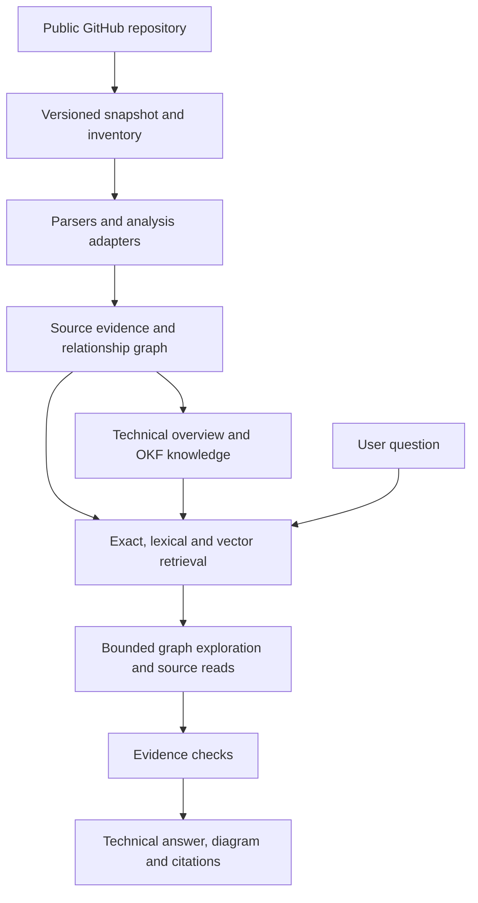

> Historical document. Current behavior is described in [the architecture guide](../architecture.md).

# Architecture rework: repository understanding before feature expansion

Date: 2026-09-25. Status: core implementation delivered; live quality evaluation and platform evidence are recorded in rework-verification.md.

This document restores the user's original data flow and defines the next bounded changes. It takes precedence over the earlier milestone ordering where they conflict. It preserves the product contract in the [implementation plan](implementation-plan.md), the privacy boundary, and the user's decision to remove local repository input. The existing Phase 3 implementation remains an experimental preview, not a completed synthesis milestone.

## 1. The result we are building

A developer enters a public GitHub URL and receives a useful starting explanation of what the repository does, its components, how it starts, and how consumer actions reach the implementation. They can then ask technical follow-ups such as “What happens when a customer cancels after payment?” and see the relevant handlers, conditions, state transitions, events, workers, failure paths, tests, and source citations.

The explanation must work when documentation is absent or wrong and when related code is scattered. It must also recognize libraries, collections of examples, and disconnected projects without turning them into an invented single application. README files are supporting evidence. Directory names are discovery hints. Neither determines repository purpose.

Portable installation, packaged prompts, secret protection, and setup documentation remain required. They support this result; passing packaging or schema checks does not establish that the explanation is correct.

## 2. Reference data flow

Secret checks apply before content enters searchable storage, model requests, and exports. Every stage is scoped to one repository and immutable snapshot. The knowledge-to-retrieval arrow is essential: initial overview and OKF knowledge exist before interactive questions and help locate relevant implementation. The direct evidence-to-retrieval arrow allows discovery beyond what the generated knowledge covers.

OKF knowledge is derived from source. Its claims retain underlying evidence IDs so retrieval can reopen the source. A generated document cannot serve as independent confirmation of another generated document or answer. Old knowledge must be labeled stale or excluded when its source snapshot changes.

## 3. Baseline before the rework

| Stage | Current implementation | Required correction or completion |
|---|---|---|
| Capture and inventory | GitHub capture, immutable commit snapshots, privacy exclusions, artifact status accounting | Retain; distinguish indexed files from semantically understood files |
| Parsers and adapters | Text chunks across readable languages, Go syntax/calls, optional SCIP import | Report actual depth; expand only where a concrete evaluation needs it. SCIP's embedded-text requirement currently limits compatibility |
| Source evidence and graph | Snapshot-scoped chunks, source viewer, symbols, bounded graph endpoint | Reuse as the evidence foundation; graph absence must not prevent text-based investigation |
| Overview and OKF | Deterministic file/manifest summaries, experimental purpose heuristics, versioned overview, ZIP export | Replace interpretation with grounded synthesis and semantic support assessment. Current output does not meet the original M3 goal |
| Retrieval | Exact/lexical search and a separate optional semantic mode over source | Combine ranks when vectors are configured; include validated knowledge candidates and resolve their source dependencies |
| Investigation | Individual search and graph controls | Implement one bounded question pipeline using both evidence stores; no unrestricted agent exploration |
| Evidence checks | Evidence IDs/ranges, scope and privacy validation | Add assessment of whether the cited source actually supports each material claim and each asserted connection |
| Answers | Source results and overview UI | Technical answers, follow-up grounding, and evidence-based diagrams are not implemented |

At this baseline, no generation prompt executed in the overview. Prompt files being packaged does not mean analysis is running. An OKF ZIP passing format validation does not establish that its content explains the repository.

The recent purpose experiments exposed this gap: a shell comment became a project title, then frequent terms such as “address” and “hello” became technical-focus claims. Those are failed quality checks. More filename rules, keyword filters, or first-chunk sampling will not complete repository understanding.

## 4. How initial overview and knowledge should be generated

This is a repository-wide analysis job, independent of an incoming user question. It can use the same retrieval/source-read utilities as chat internally, but a single top-k result set cannot define its scope.

1. **Account for the full inventory.** Track readable/indexed, excluded, unsupported, failed, and pending artifacts. Keep semantic-analysis coverage separate. A bounded run that did not inspect an area must report that area as unexamined.
2. **Discover candidate components and entry points.** Use declarations, imports/references, manifests, route registrations, schemas, launch configuration, and test references. Directories and docs can suggest places to inspect. Preserve disconnected and unclassified code. A model-proposed grouping is an interpretation, not a resolved graph edge.
3. **Read implementation within bounded work units.** Cover each discovered area, split large units, and follow relevant evidence across files. Cache results by source and prompt/model versions. Persist covered and uncovered scopes when the job reaches a limit instead of claiming complete understanding from a fixed prefix sample.
4. **Synthesize technical capabilities and flows.** For each candidate capability, identify the consumer entry, implementing files, conditions, state changes, external effects, failure handling, and relevant tests. Read implementation before treating a name, dependency, or test expectation as behavior. Preserve unresolved connections.
5. **Assess claims against source.** Check scope/IDs/ranges deterministically and assess the meaning of each material claim against its cited source. Remove or downgrade unsupported claims; record conflicts between documentation and implementation. A model support assessment is useful but is not proof, so evaluation remains necessary.
6. **Publish the overview and OKF from the same accepted claims.** The overview gives orientation; knowledge concepts group findings by capability or technical flow with links to components and sources. Document count follows supported concepts, not a mandatory one-file-per-screen-section template.

For example, a supported cancellation concept would connect the request entry to validation, the cancellation state transition, refund event/worker, and unresolved delivery or transaction guarantees. A purpose paragraph should summarize such findings. It should not emerge from counting words such as “payment” or “refund.”

Use the existing component, startup, flow, overview, support-assessment, and OKF prompt templates where applicable. Keep distinct prompts only for distinct jobs; do not create another parallel prompt library or an agent framework to orchestrate them. Application code controls budgets, tools, evidence scope, and publication.

## 5. How questions use that knowledge

1. Resolve the question and conversational references against the selected snapshot.
2. Retrieve candidate knowledge concepts and raw source with exact/lexical search and configured vectors. Fuse candidate ranks and deduplicate; report unavailable retrieval capabilities.
3. Expand knowledge candidates to their original evidence. Follow supported graph edges and perform targeted source searches where edges are missing. Topic-name similarity or a shared identifier does not establish an execution connection.
4. Apply one request budget across subquestions and follow-up retrieval. Retain visited traversal states and cycle protection; use the existing hop/node/fan-out limits. Explicitly mark truncation and missing links.
5. Compose and assess a technical answer from the source that was read. Include the trigger, relevant code path, conditions and side effects. Distinguish inferred links, test expectations, and observed runtime behavior.
6. Render citations from application-owned evidence IDs. Render a diagram only for supported relationships; show unresolved links as unresolved. Prior answers and OKF summaries cannot validate the answer on their own.

This preserves both inputs to retrieval in the original diagram. It also prevents generated knowledge from hiding files or connections that were missed during initial analysis.

## 6. Scope control and stack

| Decision | Next implementation action |
|---|---|
| Keep | Git capture, snapshot identity, privacy gateway, inventory, citable chunks, source viewer, PostgreSQL/pgvector, River, bounded graph primitives, prompt packaging, existing OKF renderer |
| Remove from published interpretation | README-heading identity claims and generic filename/token-based purpose inference. Preserve useful extracted declarations in a clearly labeled evidence view |
| Replace | The deterministic interpretation in `internal/knowledge/knowledge.go` and `internal/knowledge/scope.go`, with analysis based on source evidence; retain persistence, provenance and rendering where useful |
| Freeze while proving synthesis | Correction-note features, overview version UX, additional graph UI, broad parser packs, more export formats, remote hosting and release automation. Preserve existing data and do not perform destructive schema cleanup |
| Complete on the core path | Real generation adapter, task-specific output validation, component/capability synthesis, semantic support checks, knowledge indexing, and the bounded question pipeline |

Retain Go, React/TypeScript/Vite, PostgreSQL/pgvector, River and Compose. Their replacement would not solve the current quality problem. Additional UI libraries, a dedicated graph database, a new orchestration framework, and sqlc adoption are not prerequisites. Parsing adapters remain modular; a broad grammar rollout should not postpone a working evidence-to-explanation path.

The common evidence/retrieval model remains language independent. Analysis depth varies by language/framework adapter and by available evidence. A text fallback keeps unsupported languages usable; it cannot promise equal semantic resolution. Directory layout changes must not determine whether a supported explanation is possible.

Full synthesis needs a configured generation provider. Strict-local mode requires a local generation endpoint; absent one, the product offers evidence/search and reports synthesis unavailable. Cloud generation remains an explicit installation- and repository-level opt-in. An embedding endpoint cannot substitute for generation. The implemented providers are API-key-backed OpenAI Responses and a loopback OpenAI-compatible local endpoint. Cloud use requires the cloud Compose overlay and repository opt-in; the base installation remains strict-local.

## 7. Revised sequence and acceptance gates

### R0 — Cleanup and quality baseline

Remove the experimental purpose interpretation from publication, keep useful source declarations visible, and make the current synthesis gap explicit. Reuse [the existing evaluation cases](../../testdata/evals/cases.json) rather than adding another harness. Their maintainer-review status is still pending; validate expected findings before using them to tune output. The mixed-monolith fixture already covers paid cancellation, a Python worker, event gaps, and a persistence stub.

Gate: headings and generic keywords never become repository purpose; indexed-file counts are not presented as semantic coverage. Record a baseline overview and answers/gaps for the existing fixtures and pinned real snapshots. This is the R0 acceptance criterion.

### R1 — Complete the original M3: grounded overview and OKF

Implement the source analysis described above with one generation provider behind the privacy boundary, reusing the existing storage/UI/renderer. Produce the overview before a user asks a question. Index the resulting knowledge with its source dependencies so it is usable by the next stage.

Gate: a reviewer can understand the repository's supported capabilities and implementation from the overview and inspect the cited source. Removing an unhelpful README does not remove all purpose/flow analysis. Moving related files across directories does not silently sever a flow. A library or examples repo is not presented as one deployed service. Excluded or unexamined files are visible gaps. Every material claim is assessed for source support, and the OKF bundle passes format/privacy checks. Mock-provider success alone does not satisfy this gate.

### R2 — Complete the original M4: questions through knowledge and source

Connect user questions to retrieval from both stores, bounded graph/source expansion, support checks, and technical answers. Follow-ups re-ground against the snapshot. Start with the existing cancellation and missing-consumer questions; do not add peripheral UI until these work.

Gate: the paid-cancellation answer reaches the relevant client, handler and worker, identifies the persistence stub, and does not claim a completed refund before the HTTP response. It preserves the unresolved broker connection. Cycles terminate; missing consumers, sparse graphs and unsupported parsers produce useful partial answers. Any diagram uses the same assessed claims and relationships.

### R3 — Improve measured weaknesses and finish release requirements

Compare retrieval with and without vectors, graph expansion, and knowledge concepts on the same questions and budgets. Add adapters, reranking or UI detail only for measured failures. Complete the documented platform matrix, setup, secret handling and release verification. Do not claim all platforms work because a binary cross-compiles.

Gate: each extra feature has a named failing case and a demonstrated improvement. Preserve the original architecture while avoiding another round of feature expansion before the user-facing explanation works.

## 8. Implementation and verification

The user authorized completing this sequence on 2026-09-25. Runtime changes now remove heuristic purpose, execute packaged generation/review prompts, persist resumable source units, publish overview and capability-oriented OKF from the same accepted claims, retrieve both knowledge and source, and answer scoped follow-ups with citations and bounded static diagrams.

The stack is unchanged. No new database, orchestration framework, parser pack, correction feature, hosting system or UI library was added. Migration 006 is additive and preserves previous snapshots and notes. Model outputs and model-reported gaps receive source-support assessment; partially supported or rejected wording is not published as accepted content. Local and cloud generation adapters enforce the same privacy boundary as embeddings.

[Verification and remaining release limits](../verification-history.md) records actual tests and live findings. R1/R2 cannot be considered generally proven from synthetic fixtures alone. R3 measurements determine whether extra retrieval machinery is justified; a capability's existence is not evidence that it improved the answer.
